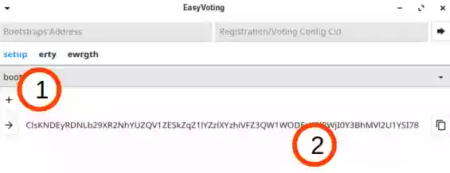

# Bootstrap

### Manager
1.  Other Bootstrap List Address can be added. (optional)
2.  A new Bootstrap List Address is generated and can be copied with the rightmost button.
3.  Publish and share the Bootstrap List Address on your own website, etc, while this software is running.

### User
1. A new Bootstrap List Address containing the Manager's one can also be generated as a mirror. (optional)

