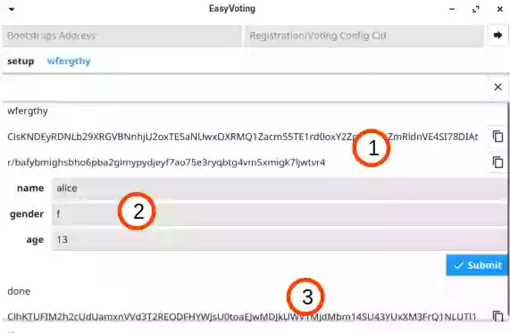

# Registration

### Manager

1. On the registration setup page, enter the following information:
- Title of the registration page
- User dataset
- Bootstrap List Address

The user dataset is a csv file containing the data required for user registration.

| label 0 | label 1 | ... | label M |
| --- | --- | --- | --- |
| user 00 | user 01 | ... | user 0M |
| user 10 | user 11 | ... | user 1M |
| ... | ... | ... | ... |
| user N0 | user N1 | ... | user NM |

2. After entering the information, press the Submit button to output Registration Config Address.
3. Publish and share the Registration Config Address on your own website, etc, and wait until registration is complete.

### User
Enter the Bootstrap List Address and Registration Config Address to go to the registration page.

1. The Addresses are displayed here.
2. Enter the data necessary for registration.
3. The User Identity will be output, so copy and keep it.

