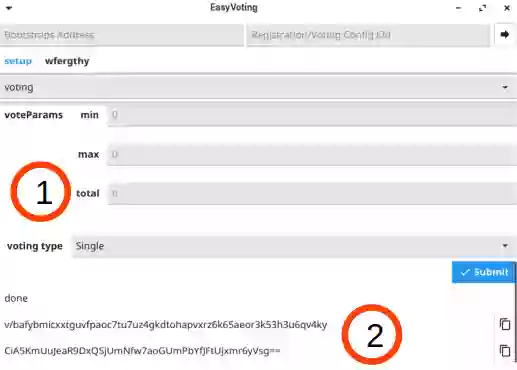
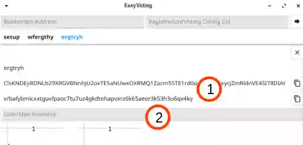
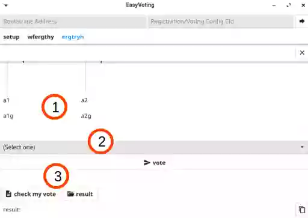

# Voting

### Manager

1. On the voting setup page, enter the following information:
- Voting page title
- Start time
- End time
- Time zone (Location)
- Bootstrap List Address & Registration Config Address
- Candidate Information
  - Image
  - Name
  - Group
  - URL
- Voting Parameters
  - Minimum Number of Votes
  - Maximum Number of Votes
  - Total Votes
- Voting Type

2. Press "+" button to add a candidate, each "x" button to remove the corresponding candidate.

1. Voting Parameters may be ignored for some kinds of Voting Type.
2. After submitting the information, Voting Config Address and Manager Identity are generated, publish the Voting Config Address and save the Manager Identity locally.

### User and Manager

1. The Addresses are displayed here.
2. Input your User/Manager Identity to vote/tally votes.

1. The order of candidates changes each time the page is displayed.
2. The voting form varies depending on Voting Type
3. When users vote and manager presses vote button, users can check their own votes, and everyone who has been accessing the voting page before the time limit can tally the votes.

